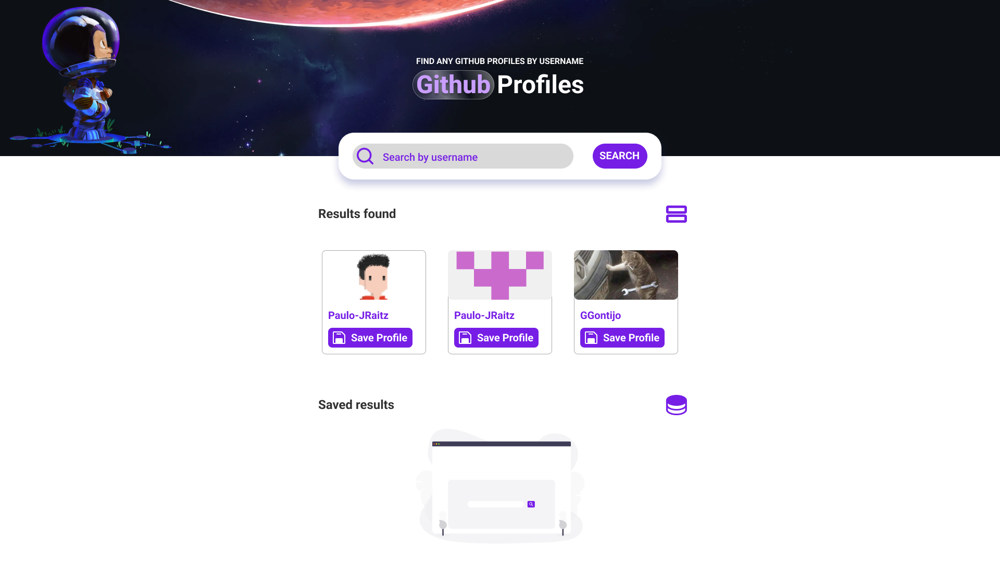

# 🖥️ GH Users - Projeto de estudo | Fatec - ADS

## 📝 Descrição

Projeto de estudo para a disciplina de Desenvolvimento de Aplicações Web, ministrada pelo intusiasta de tecnologia: Paulo Raitz

## 📌 Objetivo

O objetivo do projeto é criar uma aplicação web que consuma a API do GitHub e exiba os dados dos usuários pesquisados.
também será possível salvar os usuários pesquisados em um banco de dados local.

## 📚 Tecnologias

- [x] HTML
- [x] CSS
- [ ] JavaScript
- [ ] Axios

## 📝 Layout

# 📝 Autor

